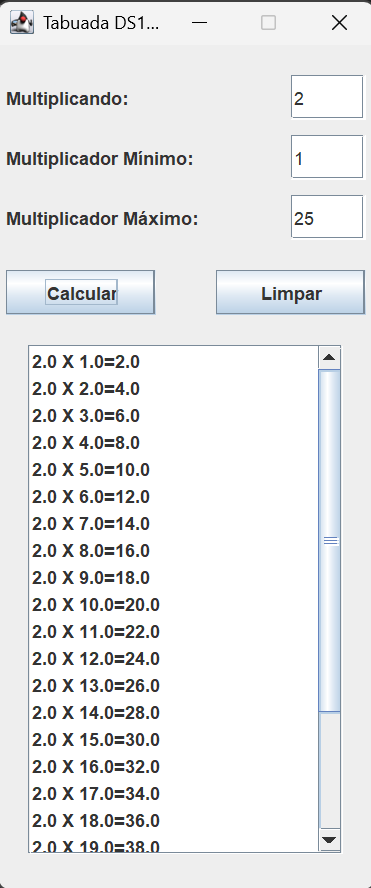

"# lopal_Tabuada" 

Atividade introdução a interface gráfica usando JFrame, desenvolvido nas aulas da disciplina Logica e Programação do curso Desenvolvimento de Sistemas no Senai

## Tecnologias utilizadas
* Java

## Autor

[Edvan Alves](https://br.linkedin.com/in/edvan-alves)